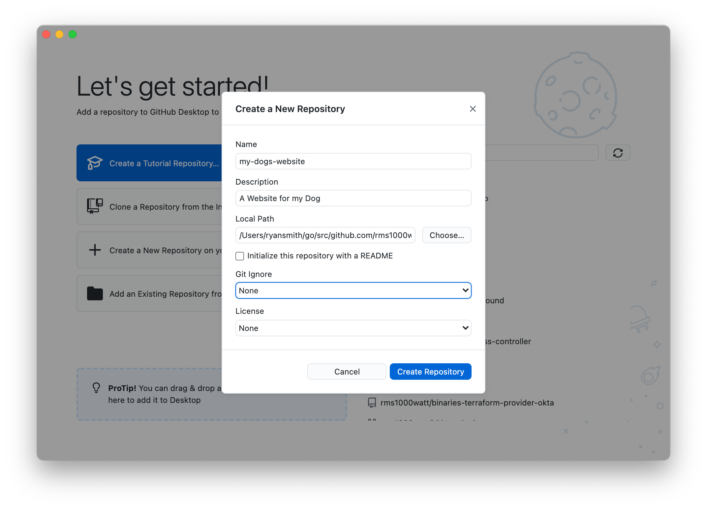

# My Dogs Website

## Introduction

Repo: [github.com/rms1000watt/my-dogs-website](https://github.com/rms1000watt/my-dogs-website)

## Contents

- [Tutorial](#tutorial)

## Tutorial

- Download the [Github Desktop App here](https://desktop.github.com/)
- Open it
- Sign up or Sign in
- Create a new repository on your hard drive

- Name the repository `my-dogs-website` and save it to a `Local Path` that you won't forget. Click `Create Repository`

- At this point, you have an empty repository on your hard drive. Now you need to put something in it.
- I recommend downloading [Visual Studio Code here](https://code.visualstudio.com/)
- Now you can edit your empty repository with Visual Studio Code

